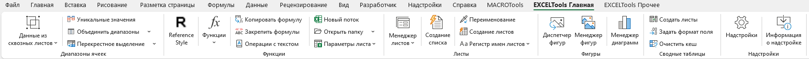
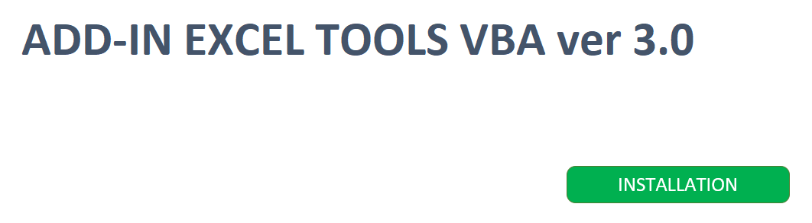

**Русский** | [English](README_ENG.md)
---

# Addin_ExcelTools

> **Надстройка Excel VBA для профессиональной автоматизации Excel**
>
> **Автор:** VBATools
> **Версия:** 3.0.24
> **Лицензия:** [Apache License](LICENSE)

> [!IMPORTANT]
> **Пароль от VBA-проекта:** `1`
>
> Код открыт, пароль защищает только от случайных изменений.

---

## 📑 Оглавление

* [📋 Описание](#-описание)
* [🚀 Установка](#-установка)
* [🧰 Список инструментов и функций](#-список-инструментов-и-функций)

---

## 📋 Описание

**ExcelTools** - это профессиональная надстройка Excel VBA, предоставляющая обширный набор инструментов для автоматизации рутинных задач в Excel. Включает 100+ инструментов: формулы, манипуляции с данными, управление листами, файловые операции, диаграммы, фигуры и многое другое.

  
   
  <em>Главная панель управления</em>

  
   
  <em>Прочие инструменты управления</em>

---

## 🚀 Установка

1. Скачайте `Addin_ExcelTools.xlsm` из репозитория.
2. Откройте файл в Excel и разрешите выполнение макросов.
3. Нажмите кнопку **Установить**.
4. На ленте инструментов появятся две вкладки: **EXCELToolsГлавная** и **EXCELToolsПрочие**.

  
   
  <em>Установка надстройки</em>

---

## 🧰 Список инструментов и функций

Надстройка включает более 100 инструментов, разделённых на логические категории:

### 📊 Диапазоны ячеек

#### 📥 Сбор и загрузка данных из листов и книг
* Сбор данных из листов, имеющих одинаковую структуру данных
* Загрузка данных в листы, имеющие одинаковую структуру данных
* Сбор данных из книг, имеющих одинаковую структуру данных
* Загрузка данных в книги, имеющие одинаковую структуру данных
* Создание книг по шаблонной книге

#### 🔢 Уникальные значения
* Получение диапазона уникальных значений

#### 🧩 Объединение и разделение ячеек
* Объединение ячеек без потери данных
* Объединение ячеек с одинаковыми данными
* Разделение ячеек

#### 🎯 Перекрёстное выделение ячеек
* Выделение строки и столбца активной ячейки

### 🧮 Функции

#### 🔄 Reference style (Стиль ссылок)
* Переключение стиля ссылок на ячейки: A1 ↔ R1C1

#### ➗ Вычисления
* **Операции вычислений** - выполняет вычисления над диапазоном (округлить, умножить, сложить, вычесть, разделить и прочее)
* **Блокировка ошибок** - оборачивает формулу в `ЕСЛИОШИБКА()`
* **Копировать формулу без изменений**
* **Закрепить формулы** - циклично изменяет тип ссылок в формулах: `$A1 → $A$1 → A$1 → A1`
* **Операции с текстом** - набор инструментов преобразования строк
* **Новый поток** - запускает экземпляр приложения Excel в новом потоке
* **Открыть папку** - открывает папку, в которой расположена активная книга Excel
* **Параметры листа**:
  * Показать/скрыть нули
  * Показать разбиение на страницы
  * Группировка данных:
    * Итоги в строках под данными
    * Итоги в столбцах справа от данных
    * Показать/скрыть символы структуры

#### 📐 Пользовательские функции
* **Обработка текста и строк**:
  * `ЗАМЕНИТЬ_СИМВОЛЫ` - посимвольная замена символов
  * `ЛЕВО_ТЕКСТ` - возвращает текст слева от разделителя
  * `ПРАВО_ТЕКСТ` - возвращает текст справа от разделителя
  * `МЕЖДУ_ТЕКСТ` - возвращает текст между разделителями
  * `НАЙТИ_ЗАМЕНИТИТЬ` - находит и заменяет подстроку
  * `РАЗБИТЬ_СТРОКУ` - разбивает строку на части по символу разделителю
  * `СЦЕПИТЬ_МУЛЬТИ` - объединяет несколько диапазонов
  * `ТЕКСТ_СООТВЕТСТВУЕТ_ШАБЛОНУ` - проверяет текст по шаблону (Like)
  * `ТРАНСЛИТ` - транслитерирует текст (4 стандарта)
  * `УДАЛИТЬ_СИМВОЛЫ` - удаляет символы из текста
* **Извлечение данных из ячеек**:
  * `ПОЛУЧКОММЕНТ` - возвращает текст комментария ячейки
  * `ПОЛУЧТЕКСТ` - возвращает только буквы из ячейки
  * `ПОЛУЧЧИСЛО` - возвращает только цифры из ячейки
  * `ТЕКСТФОРМУЛЫ` - возвращает формулу ячейки как текст
* **Заливка и цвет шрифта**:
  * `СУММЗАЛИВКА` - суммирует по цвету заливки
  * `СУММШРИФТ` - суммирует по цвету шрифта
  * `СЧЕТЗАЛИВКА` - считает количество по цвету заливки
  * `СЧЕТШРИФТ` - считает количество по цвету шрифта
* **Информационные функции**:
  * `ИМЯКНИГИ` - возвращает имя книги
  * `ИМЯЛИСТА` - возвращает имя листа
  * `ИМЯПОЛЬЗОВАТЕЛЯ` - возвращает имя пользователя
  * `ПОЛНЫЙПУТЬКНИГИ` - возвращает полный путь к книге
* **Прописи**:
  * `ПРОПИССУММ` - записывает числовое значение прописью
  * `ПРОПИСДАТА` - записывает дату прописью
  * `ПРОПИСВРЕМЯ` - записывает время прописью
* **QR-код**:
  * `СОЗДАТЬ_QR` - создаёт QR-код из значения в ячейке
  * **Создать QR-код в файл** - создаёт QR-код в виде файла из данных в ячейках

### 🗂️ Менеджеры

#### 📄 Менеджер листов книги
* **Создать лист-оглавление** - создаёт лист `Оглавление` со списком всех листов и информацией о них
* **Сортировка листов** - сортирует листы по алфавиту и цвету ярлычков листов
* **Поменять видимость** - меняет видимость листов: скрытый, суперскрытый и видимый
* **Копирование выделенных листов** - копирует выделенные листы заданное количество раз
* **Удаление выделенных листов** - удаляет выделенные листы
* **Включение и выключение защиты листов**
* **Задать масштаб** - изменяет масштаб выбранных листов
* **Экспорт листов в файлы** - экспортирует листы в отдельные файлы с заданным типом файла
* **Импорт листов из книг** - вставляет листы из других книг в активную книгу
* **Группировка данных** - создаёт структуру группировки на выбранных листах
* **Закрепление области** - закрепляет или снимает закрепление области
* **Сменить цвет ярлыков листов**
* **Создать новый лист**
* **Синхронизировать листы** - устанавливает тот же масштаб и выделяет ту же ячейку, что и на шаблонном листе

#### 📚 Менеджер книг
* **Сохранить выбранные** - сохраняет выбранные книги
* **Закрыть выбранные без сохранения**

#### 🏷️ Менеджер имён книги
* **Удаление выделенных имён**
* **Поменять видимость имён**

#### 🎨 Менеджер стилей книги
* **Удаление выделенных стилей**

### 🔷 Фигуры

#### 🗃️ Диспетчер фигур
* **Копирование выделенных фигур** - копирует фигуры заданное количество раз
* **Удаление фигур**
* **Переименовать фигуры**
* **Поменять видимость фигур**
* **Выгрузить из книги** - выгружает фигуры из книги как картинки в заданном формате
* **Загрузить в книгу** - загружает картинки в книгу
* **Изменить текст в фигуре**
* **Добавить к тексту в фигуре**
* **Копировать размеры** - копирует размеры выбранных фигур
* **Вставить размеры** - применяет ранее скопированные размеры к выбранным фигурам

#### 🔶 Менеджер фигур
* **Выравнивание фигур** - выравнивает фигуры по вертикали или горизонтали с заданным количеством строк или столбцов и расстоянием между фигурами
* **Копирование диапазона в фигуру**
* **Копирование в фигуру со связью с диапазоном**
* **Привести к размеру ячейки** - приводит размер фигуры к размеру ячейки

#### 📊 Менеджер диаграмм
* **Изменить заливку ряда данных** - изменяет заливку ряда данных диаграммы на цвет заливки её исходных данных

### 📈 Сводные таблицы

* **Создать листы по фильтру сводной таблицы**
* **Задать формат поля сводной таблицы**
* **Очистить кеш сводной таблицы от данных, удалённых из сводной таблицы**

### 🔌 Надстройки

* **Надстройки** - включает и отключает надстройки
* **Информация о надстройке**

### 🔑 Пароли

* **Удалить пароли с проектов VBA**
* **Удалить пароли с листов и структуры книги**

### 🧹 Очистка книги

* **Информация о файле** - отображает общие и пользовательские свойства книги
* **Сбросить форматы** - удаляет избыточные форматы в книге
* **Удалить скрытые имена в книге**
* **Неразрывные связи книги** - создаёт лист с информацией обо всех связях в книге
* **Выгрузить прикреплённые файлы из книги**

### 📁 Файлы

* **Создать список файлов** - создаёт лист со списком файлов в выбранной папке
* **Переименование файлов** - переименовывает файлы по списку

### 💬 Примечания

* **Примечания** - создаёт лист со списком всех примечаний в книге
* **Создать примечания** - создаёт примечания из данных выбранного диапазона
* **Показать примечания** - отображает все примечания на активном листе книги
* **Скрыть примечания** - скрывает все примечания на активном листе книги
* **Размер шрифта** - задаёт размер шрифта всем примечаниям на активном листе книги

### 🛠️ Прочие инструменты

* **Создать резервную копию книги** - создаёт резервные копии книги, присваивая каждой её версию
* **Групповой подбор параметров**
* **Добавить через пустые строки/столбцы**
* **Экспорт диапазона данных в JSON или CSV**